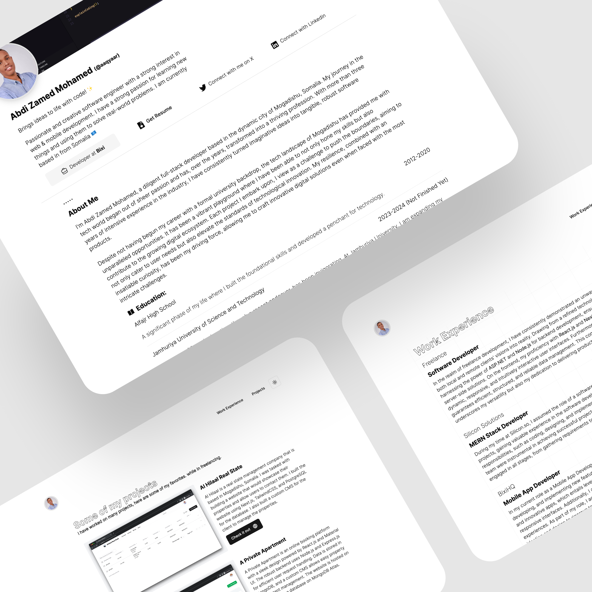

# Abdi Zamed Mohamed's Portfolio

Welcome to my GitHub repository of Abdi Zamed Mohamed's personal portfolio. This repository contains the source code and assets for the portfolio, showcasing my skills, experiences, and projects. You can view the live version of the portfolio at the link provided below.

[](https://abdizamedmo.vercel.app/)

> **Live Portfolio**: [https://abdizamedmo.vercel.app/](https://abdizamedmo.vercel.app/)

## Features

- **Responsive Design**: Ensures the portfolio looks great on devices of all sizes, from mobile phones to desktops.
- **Dynamic Content**: Leveraging modern web technologies to provide an engaging user experience.
- **Clean Code**: Well-structured and commented code for easy understanding and potential collaboration.
- **Interactive UI**: Provides an intuitive navigation experience for visitors.

## Sections

1. **Home**: A brief introduction and welcoming note.
2. **About**: Dive deeper into my background, skills, and passions.
3. **Projects**: A showcase of some of the best projects that i was worked on.
4. **Experience**: A timeline of my professional journey.
5. **Contact**: Ways to get in touch with me.

## Technologies Used

- React (Next.js)
- Tailwind CSS
- Hygraph (GraphCMS)
- [Vercel](https://vercel.com/) for deployment

## Running Locally

To set up this portfolio on your local machine:

1. Clone the repository:

```
git clone https://github.com/aaqyaar/abdizamed.git portfolio
```

2. Navigate to the project directory:

```
cd portfolio
```

3. Install the dependencies:

```
yarn install
```

4. Run the development server:

```
yarn dev
```

5. Open the `localhost:3000` in your browser to view the portfolio.

## Contributing

While this is primarily a personal project, suggestions and feedback are welcome. Feel free to open an issue or submit a pull request for improvements or feature suggestions.

## License

This project is under the MIT License - see the [LICENSE.md](LICENSE.md) file for details.

---

Thank you for visiting! Explore more about my journey in tech, and reach out for questions or collaboration ideas!
